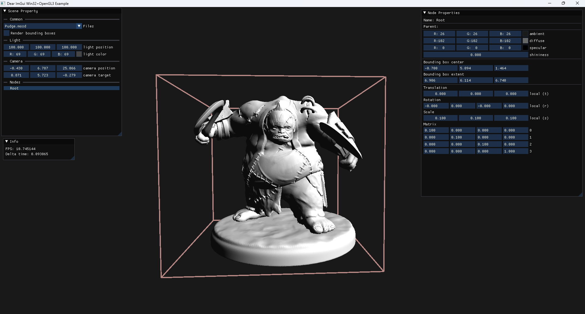

# ComputerGraphicsDemo

The desktop application is designed to render [MOSD](#mosd-format) files. It can apply objects, camera and lighting transformations.

# Tables of contents
* [Features](#features)
* [Used technologies](#used-technologies)
* [MOSD](#mosd-format)
* [Example](#example)

# Feautures

* Own file scene description file format ([MOSD](#mosd-format)).
* Pan and orbit transformations can be applied to the camera and scene nodes.
* Selectable scene nodes (using the cursor or "Scene" view in "Scene Property" window).
* Parent-child relationship.
* Partial OBJ reader.
* Phong lighting model.
* Material, light settings.
* Local transformations settings.

# Used technologies

* Dear ImGui
* OpenGL
* DirectXMath
* C++17

# MOSD format

# Example
